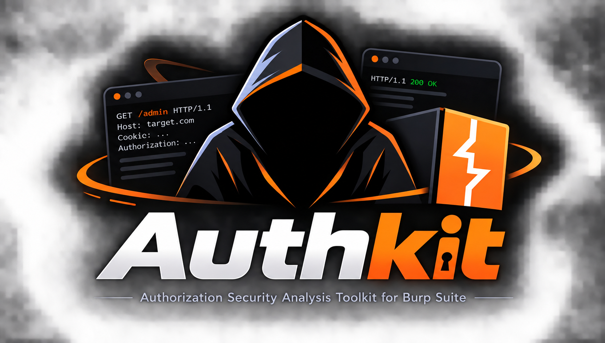
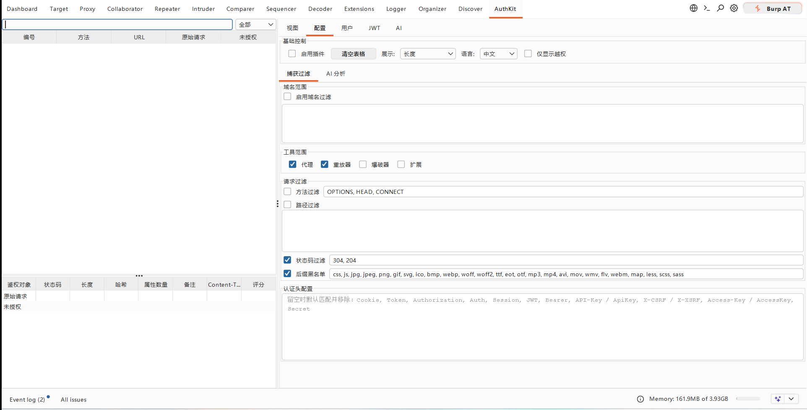
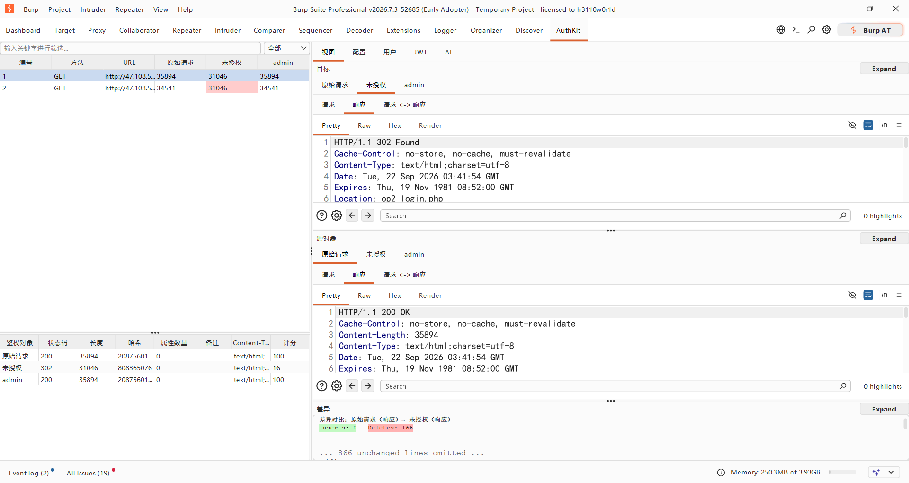
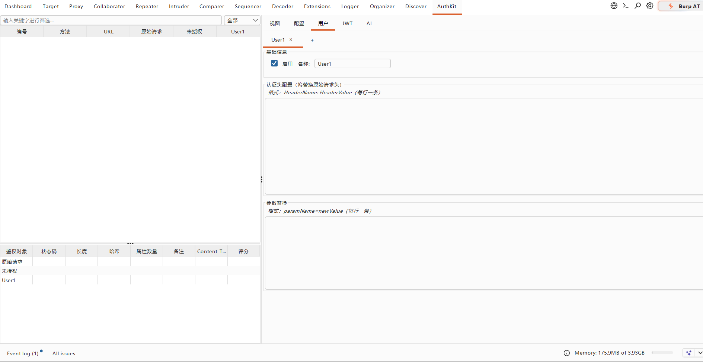
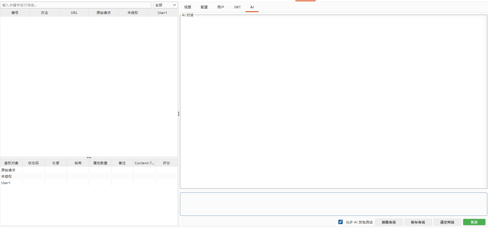
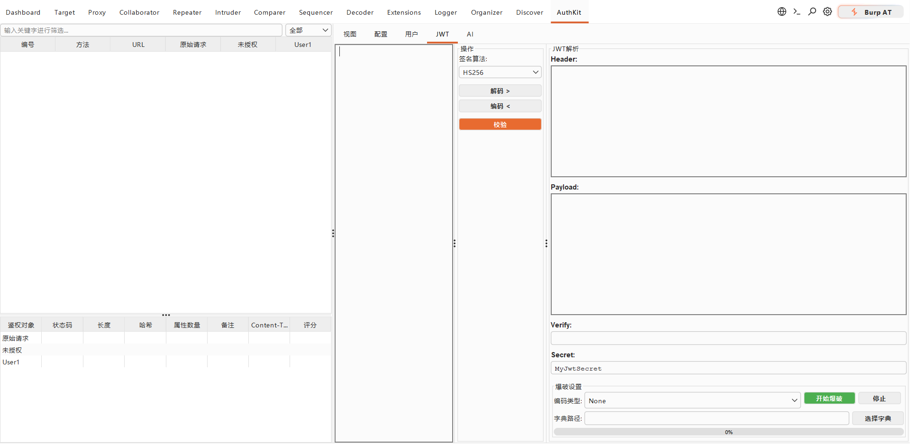
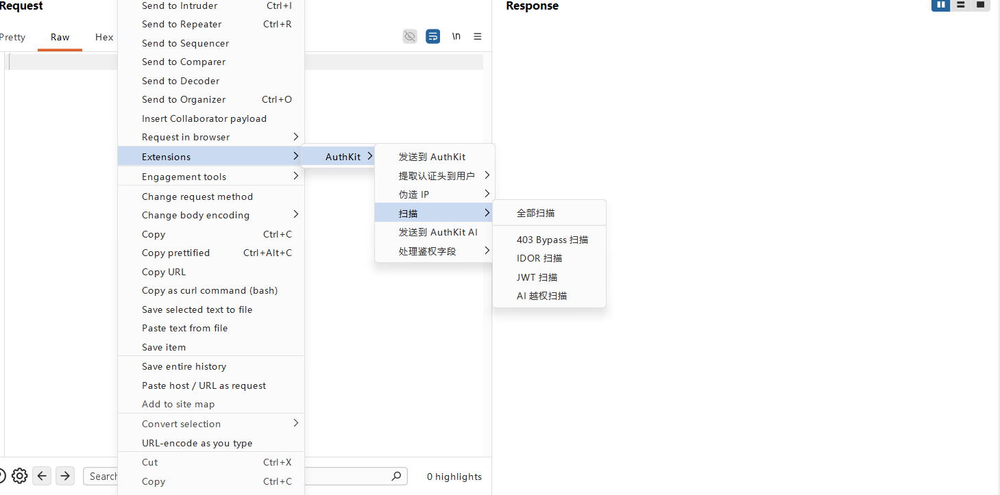

## AuthKit

> 面向渗透测试人员和安全工程师的 Burp Suite 越权检测辅助插件。

> AuthKit 2.0：品质升级，优化响应归一化与越权评分算法，增强 AI 辅助分析，提升检测效率与使用体验。

AuthKit 用于把一条业务请求快速扩展为 `Original / Unauthorized / 多角色` 对比样本，帮助你更高效地发现：

- 未授权访问
- 水平越权
- 垂直越权
- 对象级授权缺失（BOLA）

它支持**被动捕获流量**、**右键主动送测**和 **AI 辅助分析**，适合放在 Burp 的日常测试流程里使用。

|配置界面|视图界面|
|---|---|
|||
|鉴权用户管理界面|AI分析界面|
|||
|JWT分析界面|右键菜单界面|
|||

---

## 核心能力

- **多身份自动重放**：自动生成 `Original`、`Unauthorized`、`UserA/UserB/...` 对比结果
- **多维指标展示**：支持 `Length`、`Status Code`、`Hash`、`AttributeNum`、`Rank`
- **归一化评分**：响应体按 `L0 原文 → L1 标准 → L2 激进` 递进归一化，剔除时间戳、UUID、token 等动态噪声后再比对，`Original` 固定 100 分
- **快速定位异常**：表格差异染色、元数据面板、`Response Diff`
- **右键菜单联动**：送测、提取认证头、处理鉴权字段、伪造 IP、专项扫描
- **灵活范围控制**：支持 `Domain Scope`、`Request Filter`、`Tool Type Scope`
- **专项扫描**：`403 Bypass`、`IDOR`、`JWT` 三类主动扫描，一键生成并发送变体请求
- **AI 辅助分析**：接入 LLM 对话分析数据包，内置发包工具可让 AI 迭代验证越权
- **JWT 工具箱**：解码 / 编码 / 校验 / 爆破，并在 Burp 请求与响应编辑器中提供 JWT 选项卡
- **结果导出**：选中结果导出为 `CSV` 或 `HTML`，便于归档与汇报
- **中英文界面**：可在配置面板一键切换

---

## 适用场景

- 用 `Unauthorized` 快速排查未授权访问
- 用 `UserA / UserB` 对比水平越权
- 用 `User / Admin` 对比垂直越权
- 用参数替换验证资源 ID、租户 ID、用户 ID 等对象访问控制
- 在 `Proxy` / `Repeater` 中批量巡检高风险接口
- 用专项扫描批量验证 403 绕过、IDOR 与 JWT 校验缺陷
- 让 AI 基于实际响应迭代发包，辅助判断越权结论

---

## 快速开始

### 环境要求

- Java 17+
- Maven 3.8+
- Burp Suite（支持 Montoya API）

### 本地构建

```bash
mvn clean package
```

运行测试：

```bash
mvn test
```

产物（两份内容相同，均为含全部运行时依赖的胖 JAR）：

```text
target/AuthKit-2.0.0.jar                   # Maven 标准产物（版本号取自 pom.xml）
out/artifacts/AuthKit_jar/AuthKit.jar      # 同步给 IDEA 产物目录，文件名固定
```

推送 `v*` 标签时 CI 会分别用 Java 17 和 Java 21 各构建一个 JAR 并发布；**标签版本必须与 `pom.xml` 的 `<version>` 一致**，否则流水线直接失败。插件内显示的版本也读取同一来源，无需手改代码。

### 加载到 Burp

`Extensions` -> `Installed` -> `Add`

### 最小配置

1. 在 `Configuration` 中勾选 `Enable Plugin`
2. 在 `Capture & Filter` 选项卡的 `Auth Headers` 中填写要在未授权场景移除的头，例如：`Cookie`、`Authorization`、`Token`
3. 保持 `Tool Type Scope` 默认值：`Proxy`、`Repeater`
4. 在 `User` 中添加测试角色，并配置认证头或参数替换规则
5. 如需 AI 分析，在 `AI Analysis` 选项卡中填写 `API Key`、`Base URL`、`Model` 并测试连接

---

## 使用流程

1. 在 `Proxy` / `Repeater` 中捕获请求，或右键选择 `发送到 AuthKit`
2. 先看 DataTable 中的 `Length / Hash / AttributeNum / Rank`，可用工具栏按 `Host / Length / Hash / Request / Response` 筛选
3. 点击可疑鉴权对象列，联动查看 `Target` 的 `Response`
4. 在 `View` 中对比 `Source / Target / Diff`
5. 结合业务语义确认是否存在越权

---

## AI 辅助分析

在右侧 `AI` 选项卡中与 LLM 对话，分析当前选中数据包是否存在越权。

### 配置

在 `Configuration` -> `AI Analysis` 中设置：

- `API Key` / `Base URL` / `Model`
- `Request Format`：`OpenAI`、`Anthropic`、`Ollama`
- `Max Packets per Analysis`

### 对话能力

- **按需拉取数据包**：数据包不会随提问自动附带，模型按需调用内置工具拉取数据表中选中的对比报文；也可用右键 `发送到 AuthKit AI` 主动送包
- **消息卡片**：彩色角色标签 + 时间戳，悬停显示复制按钮，AI 回复渲染 Markdown
- **思考过程可折叠**：AI 的推理内容默认收起，点击 `▶/▼` 展开
- **可暂停生成**：生成过程中按钮变为 `暂停`，点击即中止本轮（含模型回复与工具调用）
- **长消息内部滚动**：你发送的内容过长时气泡内出现滚动条，不会撑高整个对话区
- **会话保存 / 加载**：对话历史导出为 JSON，随时恢复

### 内置工具

| 工具 | 标记块 | 行为 | 是否需要确认 |
| --- | --- | --- | --- |
| 数据表数据包 | `<<<GET_PACKETS>>>` | 回填数据表当前选中记录的 `Original / Unauthorized / 各用户` 报文 | 不需要（只读本地数据） |
| Proxy 历史 | `<<<GET_PROXY_HISTORY>>>` | 由你在弹窗中从 Proxy 历史挑选报文 | **需要选择** |
| 站点地图 | `<<<GET_SITEMAP>>>` | 由你在弹窗中从站点地图挑选报文 | **需要选择** |
| 询问用户 | `<<<ASK_USER>>>` | AI 给出问题与最多 3 个建议选项，你在对话里选一个、自己填写或取消 | 你直接回答 |
| 发送请求 | `<<<SEND_HTTP_REQUEST>>>` | 经 Montoya 实际发出 HTTP 请求 | **需要批准** |

数据包**不会自动全量提供给 AI**：Proxy 历史与站点地图的候选按"越权测试价值"评分排序（含对象 ID 的接口优先），高价值项会被预选为建议，最终发送哪些由你勾选；单次最多 20 条，全量发送需二次确认。

选择弹窗会先在后台读取候选（大历史下不卡界面），读取完成后可按 **域名（Host）下拉框**二次筛选，首项为"全部域名"。关键词没匹配到候选时（例如模型给的是整句描述），弹窗会退化为展示全部候选并给出提示，不会出现"有数据却空白"的情况。

模型**没有指定 URL / 域名 / 关键词**时不会直接弹窗，而是先在对话里弹出一张黄色询问卡片，由你选择：`选择数据包` 自己挑、`重新描述` 补充范围（例如域名、路径、接口关键词）、在 `其他` 里直接写下你的范围，或 `取消`。

AI 在**不清楚你的意图**时也会主动发问（同一个黄色卡片）：给出问题与最多 3 个建议选项（模仿 Claude 的选择建议），你可以点选项、自己填写回答，或取消让 AI 自行判断。

**发包工具**：启用 `Allow AI to send requests`（默认开启）后，AI 可在对话中请求实际发送 HTTP 请求并读取响应，从而迭代验证越权。每次发包都会在对话流中插入批准卡片，由你决定：

- `Deny`：不发送，并向模型回传中性反馈，避免其反复重试
- `Approve once`：只放行这一次
- `Approve for session`：本次会话后续发包免确认

单轮提问的工具调用次数存在上限，防止模型循环调用失控。

### AI 越权扫描

右键菜单 `AI 越权扫描` 打开扫描弹窗（布局与 `IDOR 扫描` 等一致）：

- **配置区**：待分析数据包（初始为右键选中的报文，可再从 Proxy 历史 / 站点地图挑选，支持多个）+ **内置提示词，可自由编辑**
- **结果区**：`AI 发送的数据包` 表格 + 请求 / 响应查看器，选中某行即可查看 AI 实际发出的报文
- 点 `开始 AI 越权扫描` 后自动切到 `AI` 选项卡开始分析；扫描过程中 AI 每次发包仍需你在对话中批准（弹窗不阻塞主界面）

---

## 专项扫描

三类扫描均从右键菜单发起，结果以弹窗展示：上方为配置与状态，中部为结果表格，下方为请求 / 响应查看器。

### 403 Bypass 扫描

对返回 403 的接口批量尝试绕过策略：HTTP 方法切换、路径变形、`URL` 覆盖头、来源 IP 头组合。支持设置线程数与是否跟随重定向。

### IDOR 扫描

围绕对象标识符生成变体：删除鉴权字段、数字参数与路径段启发式变形、常见权限路径段互换、同 Host 历史参数 / 路径值替换、无鉴权参数时的 API 分配 fuzz。响应哈希发生变化的结果行会高亮，便于快速定位。

### JWT 扫描

覆盖签名校验绕过、`none` 算法、`kid` 注入以及 HMAC 弱密钥场景，并在结果中展示每个数据包与基线的相似度。

---

## JWT 工具

右侧 `JWT` 选项卡提供：

- **解码 / 编码**：Header、Payload 双向转换
- **校验**：使用指定算法与密钥验证签名
- **爆破**：基于字典与编码类型枚举弱密钥

此外，当 Burp 的请求或响应中包含 JWT 时，对应编辑器会多出一个 `JWT` 选项卡：

- 请求侧支持**多 JWT**（下拉切换），编辑 Header / Payload 会实时重建 token 并回写到请求中
- 响应侧同样可查看响应体中的 JWT

---

## 怎么看结果

优先关注：

- `Unauthorized` 的 `Rank` 较高
- 不同角色的 `Hash`、`Length`、`AttributeNum` 很接近
- 状态码不同，但响应内容差异很小
- 本应被拒绝的请求仍返回业务字段或对象数据

说明：

- `Rank` 是风险提示，不是漏洞结论
- 高分优先看，低分不代表绝对安全
- `L2` 归一化会误伤部分真实差异（如自增 ID），评分已做降权补偿
- 最终仍需结合业务逻辑人工确认

---

## 当前支持

- `Original / Unauthorized / 多用户` 对比
- `Auth Headers` 替换、`Param Replacement`
- `Response Diff` 与元数据透视
- `Tool Type Scope`（`Proxy` / `Repeater` / `Intruder` / `Extensions`）
- Burp 右键送测与认证头提取
- 右键 `处理鉴权字段`：复制为 curl 格式、更新为最新鉴权字段、从历史选择、删除所有鉴权字段
- 右键 `随机 IP 爆破`：发送到 Intruder 后，每个数据包自动写入不同的 `X-Forwarded-For` 等伪造来源头
- 右键 `伪造 IP`：伪造指定 IP / `127.0.0.1` / 随机 IP
- Intruder Payload 生成器：`AuthKit Fake IP`（随机 IP）与 `AuthKit X-Forwarded-For`（完整 `X-Forwarded-For: <ip>` 头）
- 右键 `403 Bypass 扫描`、`IDOR 扫描`、`JWT 扫描`、`AI 越权扫描`
- AI 对话分析、会话保存 / 加载、内置工具（数据表数据包 / Proxy 历史 / 站点地图 / 发包，均按需由用户确认）
- JWT 解码 / 编码 / 校验 / 爆破，请求与响应编辑器内的 JWT 选项卡
- 选中结果导出 `CSV` / `HTML`，复制选中 URL，右键 `发送给 AI 分析`
- AI 对话支持暂停生成，长用户消息在气泡内滚动
- 中文 / English 界面切换

---

## 项目文档

| 文档 | 内容 |
| --- | --- |
| [文档导航](docs/README.md) | 文档索引与按任务的阅读路径 |
| [架构说明](docs/architecture.md) | 分层、核心数据流、主要模型、界面和并发边界 |
| [AI 分析模块](docs/ai-analysis.md) | AI 对话、内置发包工具、批准流程、会话持久化与配置 |
| [开发指南](docs/development.md) | 环境、构建、测试、i18n、变更检查和 CI |

---

## 说明

AuthKit 的定位是**越权检测辅助工具**：减少重复发包和手工比对成本，帮助你更快筛出高风险接口。
